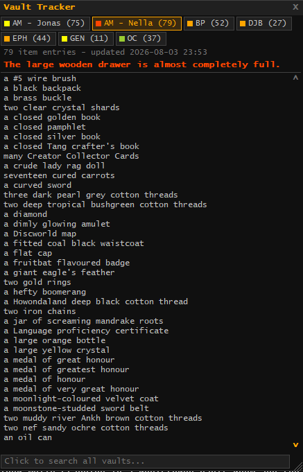
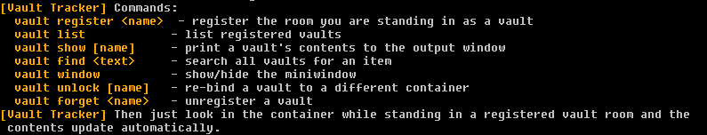

# VaultTracker

A [MUSHclient](https://www.gammon.com.au/mushclient/) plugin for [Discworld MUD](https://discworld.starturtle.net/)
that remembers what's inside your vaults and shows them in a tabbed miniwindow.

Look inside a vault container once and VaultTracker records its contents; from then on you
can browse, search, and gauge fullness of all your vaults from anywhere, across sessions.

[](https://quow.co.uk/minimap.php)

**➤ Download: [VaultTracker.xml](https://raw.githubusercontent.com/rhwone/discworld-vaulttracker/main/VaultTracker.xml)**
— right-click the link and choose *Save link as...*, then add it in MUSHclient via
**File → Plugins → Add**. ([Full instructions below.](#installation))

---

<br>



## Features

- **Automatic capture** — look in a registered vault's container and the contents are
  parsed (individual items) and saved. Multi-line item lists are handled.
- **Room-aware** — vaults are keyed by GMCP room id, so identically named containers in
  different rooms are separate vaults.
- **Container lock** — each vault binds to its own container's phrasing after the first
  capture, so looking in your backpack in the vault room won't overwrite the record.
- **Tabbed miniwindow** — one tab per vault with a color-coded fullness dot
  (green = empty → red = completely full), draggable, resizable, mouse-wheel scrolling,
  tabs wrap to multiple rows. Items sorted alphabetically (ignoring the leading quantity word).
- **Fullness display** — the container's fullness line is shown color-coded above the contents.
- **Search** — the search bar at the bottom of the window searches every vault at once and
  opens a result list showing which vault each hit is in; click a result to jump to that
  vault's tab. Also available as `vault find <text>`.
- **Persistent** — contents, window position/size, and settings survive restarts
  (MUSHclient plugin saved state).

## Requirements

- MUSHclient 4.84+
- [Quow's CowBar / minimap plugin](https://quow.co.uk/minimap.php) — VaultTracker gets its
  room information from CowBar's GMCP rebroadcast. This is the only dependency; none of
  Quow's other plugins are needed.
- CowBar's **"Re-Broadcast GMCP Data"** option must be ON: right-click the minimap and tick
  it (one-time setting). If VaultTracker can't see your room when you try to register a
  vault, it tells you exactly what to do.

## Installation

1. Download [`VaultTracker.xml`](https://raw.githubusercontent.com/rhwone/discworld-vaulttracker/main/VaultTracker.xml)
   (right-click → *Save link as...*) and place it anywhere, e.g. next to Quow's plugins.
2. In MUSHclient: **File → Plugins → Add**, select `VaultTracker.xml`.

## Usage

Stand in the room containing a vault, then:

```
vault register <name>     register the room you are standing in as a vault
```

Then simply look in the vault's container (e.g. `l drawer`). The first capture locks the
vault to that container and records everything.

```
vault list                list registered vaults (lock status, counts, timestamps)
vault show [name]         print a vault's contents to the output window
vault find <text>         search all vaults for an item
vault window              show/hide the miniwindow
vault unlock [name]       re-bind a vault to a different container
vault forget <name>       unregister a vault
vault help                command overview
```

`vault help` prints the same overview in-game:



## Beyond the guild vaults

Nothing in VaultTracker is specific to the official vaults. It only needs a room that
reports a GMCP room id and a container that lists its contents when you look inside, so
in principle a chest in a rented player home should work just as well — register the room,
look in the chest, done.

Two caveats. Because each vault is keyed to its room, this only holds for **one container
per room**: the first one you look in claims that room, and the rest are ignored (use
`vault unlock` if it binds to the wrong one). And player housing hasn't actually been
tested, so treat it as promising rather than proven — if you try it and it misbehaves,
please open an issue.

Note that contents are only as current as your last look; the timestamp above each list
tells you how stale a record is.

## License

MIT
